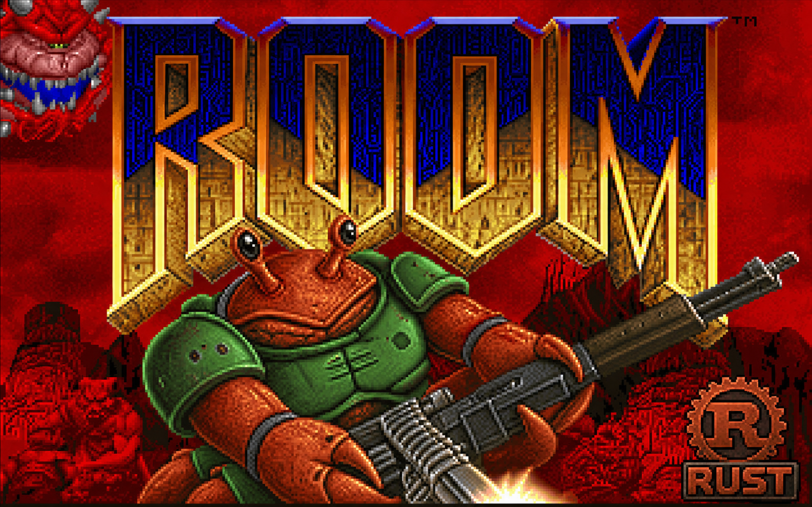

# room

<div align="center">
  
</div>

A faithful Rust port of [doomgeneric](https://github.com/ozkl/doomgeneric) using
[winit](https://github.com/rust-windowing/winit) and [wgpu](https://github.com/gfx-rs/wgpu)
for the platform layer.

## What is this?

`room` is a Rust reimplementation of the classic DOOM engine.  The port follows
a *functional approximation* approach: the initial implementation compiles the
doomgeneric C source via the `cc` crate and provides all six platform callbacks
(`DG_Init`, `DG_DrawFrame`, `DG_SleepMs`, `DG_GetTicksMs`, `DG_GetKey`,
`DG_SetWindowTitle`) in pure Rust using modern, cross-platform libraries.

As noted in the doomgeneric README, sound is hard – so we skip it for now.

## Project layout

```
room/
├── Cargo.toml               Workspace manifest
├── vendor/
│   └── doomgeneric/         Vendored C source from ozkl/doomgeneric
├── doomgeneric-sys/         Raw FFI bindings crate
│   ├── build.rs             Compiles the C source via the `cc` crate
│   └── src/lib.rs           Minimal extern "C" declarations
└── room/                    Rust binary crate
    └── src/
        ├── main.rs          winit ApplicationHandler and entry point
        ├── gpu.rs           wgpu renderer (texture upload + fullscreen blit)
        └── platform/
            ├── mod.rs       DG_* C-callable platform callbacks
            └── keys.rs      winit KeyCode → Doom key byte mapping
```

## Prerequisites

- A Rust toolchain (stable, ≥ 1.75).
- A C compiler (`gcc` or `clang`).
- A Doom WAD file (`doom1.wad`, `doom.wad`, `doom2.wad`, `freedoom1.wad`, …).
  The shareware episode is freely available from many sources.

## Building

```bash
cargo build --release
```

## Running

```bash
cargo run --release -- -iwad /path/to/doom1.wad
```

Any arguments after `--` are forwarded to the Doom engine unchanged.

## How it works

The engine runs inside the winit event loop:

1. `ApplicationHandler::resumed` creates the window and initialises the wgpu
   renderer, storing both in thread-local statics accessible to the `DG_*`
   callbacks.
2. `ApplicationHandler::about_to_wait` calls `doomgeneric_Create` on the first
   invocation (which initialises all Doom subsystems and runs the first tick),
   then `doomgeneric_Tick` on every subsequent invocation.
3. `DG_DrawFrame` (called from inside `doomgeneric_Tick`) uploads the 640 × 400
   BGRA pixel buffer produced by `I_FinishUpdate` to a wgpu texture and blits
   it to the swapchain surface via a fullscreen-quad render pass.
4. Keyboard events collected by `ApplicationHandler::window_event` are placed
   into a `VecDeque`; `DG_GetKey` pops them one at a time per tick.

## Known limitations

- **No sound.**  Sound output is deliberately omitted in this initial port.
- **No mouse support.**  Mouse aiming / strafing are not yet implemented.
- **No joystick support.**
- **Single player only.**  Networking (`FEATURE_MULTIPLAYER`) is not compiled in.
- The renderer performs a nearest-neighbour upscale from the native 640 × 400
  resolution to the window size; the window is currently fixed at 640 × 400.

## Porting progress

The goal is to incrementally replace each vendored `.c` module with a native
Rust module, preserving behaviour until the C blob is empty.

A box is ticked when the `.c` file has been removed from
`doomgeneric-sys/build.rs` and fully replaced by Rust code in the `room` crate
(or a new sub-crate). Partially ported modules stay unticked.

See [PORT.md](PORT.md) for a complexity assessment of all remaining modules and
recommended porting order.

### Engine core / game loop

- [x] `d_event.c`
- [x] `d_items.c`
- [x] `d_iwad.c`
- [ ] `d_loop.c`
- [ ] `d_main.c`
- [x] `d_mode.c`
- [x] `d_net.c`
- [x] `doomdef.c`
- [x] `doomstat.c`
- [x] `dstrings.c`
- [x] `dummy.c`
- [x] `doomgeneric.c`

### Game logic (`g_*`, `p_*`)

- [ ] `g_game.c`
- [x] `p_ceilng.c`
- [ ] `p_doors.c`
- [ ] `p_enemy.c`
- [x] `p_floor.c`
- [ ] `p_inter.c`
- [x] `p_lights.c`
- [ ] `p_map.c`
- [ ] `p_maputl.c`
- [ ] `p_mobj.c`
- [x] `p_plats.c`
- [x] `p_pspr.c`
- [ ] `p_saveg.c`
- [x] `p_setup.c`
- [x] `p_sight.c`
- [ ] `p_spec.c`
- [ ] `p_switch.c`
- [x] `p_telept.c`
- [x] `p_tick.c`
- [x] `p_user.c`

### Renderer (`r_*`)

- [x] `r_bsp.c`
- [ ] `r_data.c`
- [ ] `r_draw.c`
- [x] `r_main.c`
- [x] `r_plane.c`
- [x] `r_segs.c`
- [x] `r_sky.c`
- [ ] `r_things.c`

### Automap / HUD / status bar / finale / intermission

- [ ] `am_map.c`
- [x] `hu_lib.c`
- [x] `hu_stuff.c`
- [x] `st_lib.c`
- [ ] `st_stuff.c`
- [x] `f_finale.c`
- [x] `f_wipe.c`
- [ ] `wi_stuff.c`
- [x] `statdump.c`

### Menu / misc / math

- [x] `m_argv.c`
- [x] `m_bbox.c`
- [x] `m_cheat.c`
- [x] `m_config.c`
- [x] `m_controls.c`
- [x] `m_fixed.c`
- [x] `m_menu.c`
- [x] `m_misc.c`
- [x] `m_random.c`
- [x] `tables.c`
- [x] `info.c`

### Platform / system (doomgeneric side, not the Rust host)

- [x] `i_cdmus.c`
- [x] `i_endoom.c`
- [x] `i_input.c`
- [x] `i_joystick.c`
- [ ] `i_scale.c`
- [x] `i_sound.c`
- [x] `i_system.c`
- [x] `i_timer.c`
- [x] `i_video.c`

### Sound tables / sound subsystem (stubbed today)

- [x] `s_sound.c`
- [x] `sounds.c`

### Video / WAD / memory / utilities

- [x] `v_video.c`
- [x] `w_checksum.c`
- [x] `w_file.c`
- [x] `w_file_stdc.c`
- [x] `w_main.c`
- [x] `w_wad.c`
- [x] `memio.c`
- [x] `sha1.c`
- [x] `z_zone.c`

## License

This repository includes the unmodified Doom shareware IWAD, `doom1.wad`,
copyright id Software. It is included under the Doom shareware distribution
terms. The full registered/commercial Doom IWADs are not included and are
not redistributable.
